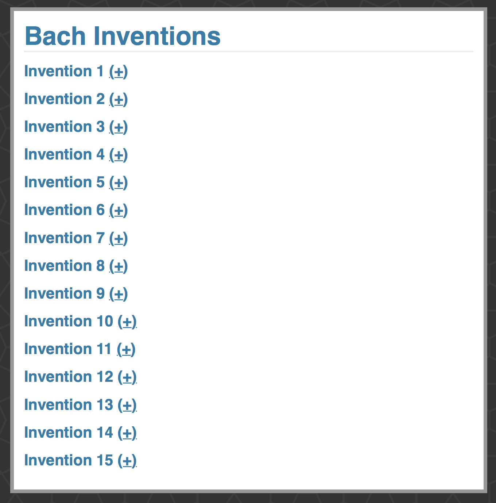
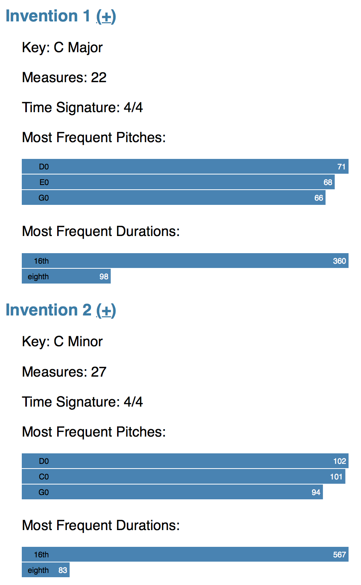
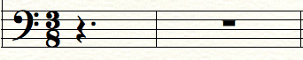
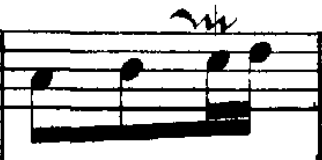
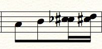

# Bach Inventions

This repository contains my Bach Invention Database project: a SQLite3 database containing all of the notes and other data from the [15 Two-Part Bach Inventions](https://en.wikipedia.org/wiki/Inventions_and_Sinfonias_(Bach)) and a fairly basic web app built with [Flask](http://flask.pocoo.org) that displays some useful information from the pieces.

## Installation

First, make sure you have the required dependencies, namely [Flask, the Python Web framework used.](http://flask.pocoo.org)

```
$ pip install Flask
```

Then, create the Bach Inventions database by opening up a Python shell and calling the ```init_db()``` function from bachApp.py

```
$ python
...
>>> from bachApp import init_db
>>> init_db()
```

Then, run parser.py to parse the music XML files and store the Inventions in the database. It will begin printing feedack as it inserts into and queries the database. The output should look something like this:

```
$ python parser.py 
Database Connection Succesful: There are 482 notes in 1 Bach Invention(s).
Database Connection Succesful: There are 1158 notes in 2 Bach Invention(s).
Database Connection Succesful: There are 1683 notes in 3 Bach Invention(s).
Database Connection Succesful: There are 2148 notes in 4 Bach Invention(s).
Database Connection Succesful: There are 2898 notes in 5 Bach Invention(s).
Database Connection Succesful: There are 3488 notes in 6 Bach Invention(s).
Database Connection Succesful: There are 3988 notes in 7 Bach Invention(s).
Database Connection Succesful: There are 4596 notes in 8 Bach Invention(s).
Database Connection Succesful: There are 5198 notes in 9 Bach Invention(s).
Database Connection Succesful: There are 5666 notes in 10 Bach Invention(s).
Database Connection Succesful: There are 6251 notes in 11 Bach Invention(s).
Database Connection Succesful: There are 6983 notes in 12 Bach Invention(s).
Database Connection Succesful: There are 7576 notes in 13 Bach Invention(s).
Database Connection Succesful: There are 8200 notes in 14 Bach Invention(s).
Database Connection Succesful: There are 8691 notes in 15 Bach Invention(s).
```

Finally, you should be good to run the web app. Run the following and navigate to http://127.0.0.1:5000/ (or another address you specify).

```
$ python bachApp.py
 * Running on http://127.0.0.1:5000/
 * Restarting with reloader
```

You should see the homescreen which looks like this:



## Overview

The web app enables the user to view all compositions within the database and expand them to gather more information. (It is dynamic meaning if more pieces were added, they would automatically appear.) Each Invention contains information on its key, measures, most common time signature, most frequent pitches, and most frequent note durations. Even this basic information can provide useful material for beginning an analysis on one of these works. For example, it is interesting that in both the pieces in C, Bach uses the note D (the second note in the scale) the most, and overall Bach seems to stick with the 16th note as the most common duration.



In the future, I hope to add more interaction within the web app including more dynamic visualizations, and more controls on what information to find. For example, it would be helpful to select which parts of each piece to query (via a slider) to gain more fine-tuned control on uncovering the notes and rhythms Bach uses. Such data could point to places where Bach changes keys or repeats ideas. Currently, these kinds of searches are possible only through manually querying the database.

## Process

Getting the notes from a piece of music to a database and then to display in a web app took a bit of work and figuring things out. There may be better ways to do it, but this was my process.

1. First, I downloaded [MIDI versions](https://en.wikipedia.org/wiki/MIDI) of the Bach Inventions from [Bach Central](http://www.bachcentral.com/midiindexcomplete.html)
2. MIDI is not the best encoding of a score, so I opened up each MIDI file with [Finale 2014](http://www.finalemusic.com), and copied from a PDF of Bach Inventions the exact notes, rhythms, and accidentals. There were a number of challenges in this that I describe below.
3. Then, using Finale's export feature, I saved each Invention in the [Music XML format.](http://www.musicxml.com)
4. Following the MusicXML guidelines, I wrote a script in Python to parse each Invention, and store it in a SQLite3 database.
5. Finally, I queried the database within my web app and displayed some information via text, and other information visually via [d3.js](http://d3js.org).

### Schema

For this project, I have designed the schema specifically for Bach Inventions. The schema could be expanded in the future to include a composer table and compositions that functionally depend on the composer. Primary keys could be the composer followed by the [opus number.](https://en.wikipedia.org/wiki/Opus_number). The primary key is in bold.

* Invention (*inumber: int, book: int*, key: varchar)
  * Book refers to the collection of two-part vs three-part inventions (known as the Sinfonias).
* Part (*inumber: int, book: int, pnumber: int*)
* Measure (*inumber: int, book: int, pnumber: int, mnumber: int*, timeSig: varchar)
* Note (*inumber: int, book: int, pnumber: int, mnumber: int, position: int*, duration: varchar, pitch: varchar, octave: int)

## Challenges and Notes for Future Implementations

I intentionally selected the Bach Inventions since they are fairly simple, written in only two parts, all adhere to the same formatting, and do not contain any dynamics or other markings. As a result, I took some shorcuts that I would need to fully implement if I were to expand this to contain pieces from other composers.

* One of the challenges with music XML is chords or places where an instrument is playing more than one note at one time. [Music XML uses ```forward``` and ```backward``` syntax to indicate it is changing places in the measure to signify multiple notes in one place.]((http://www.musicxml.com/tutorial/the-midi-compatible-part/multi-part-music/)) This is a bit trickier to parse, as in my current implementation I only need to move in one direction in the document to figure the positions of notes. (I have removed the chords in the rare cases where Bach has used them to flesh out the final harmony.) Since almost every composition uses harmony, a more comprehensive parser needs to implemented, and the schema may need to be slightly changed to uniquely identify notes in the same position.
* MusicXML indicates note accidentals based off of alteration to the measure's key signature. In other words a Bb in the key of Bb would have note value "B" and alteration value "0". This is somewhat counterintuitive to me and a little harder to parse since the key signature state would have to be remembered at all times. For simplicity I used a key signature with no sharps or flats meaning the note's pitch always matched its alteration. This may not be possible for pieces with changing key signatures where you want to know the exact pitch and the current key signature.
* A bug in the way Finale represents full-measure rests caused my parser to crash. Finale automatically fills empty measures with rests, but by appearence alone. If the user does actually fill anything into a measure then nothing actually exists. The following two measures consist of a full-measure rest, but the one on the right actually has nothing in it. (This is easily solved by manually sticking in a rest.)



* I ignored tied notes, or notes that exist in two measures at once. How should these be identified within a schema? Should notes have a position value that represents there position in the entire piece? Other strange, but very common markings that exist between notes such as slurs will need to be considered.
* I also ignored trills between notes. These were particularly annoying to deal with since MIDI incorrectly represents them. The first example is how the trill should look, but the second example is how it was represented in MIDI.





### Musical Notes

* Pitch: Note name followed by its alteration. For example, "C0" is C, "C+1" is C sharp, C-1 is C flat. This seemed like the easiest way to represent notes since Bach occasionally uses double flats and double sharps, and can be used for microtones. If the current pitch is a rest, it simply as the string "rest."
* Octave: [The octave number ranges from 0 to 9 specifying the octave range it is in.](https://en.wikipedia.org/wiki/Scientific_pitch_notation) Middle C on a piano is also called "C4." Rests do not have an octave field.
# Duration: Duration is a string representing the type of note or rest, e.g. "16th" or "quarter." MusicXML also represents durations as [divisions per quarter note](http://www.musicxml.com/wp-content/uploads/2012/12/musicxml-tutorial.pdf), though for now I did not find this useful. 
* Position: The note's position. There may be other ways of doing this such as a global position value, or a fraction representing its exact spot in the measure.